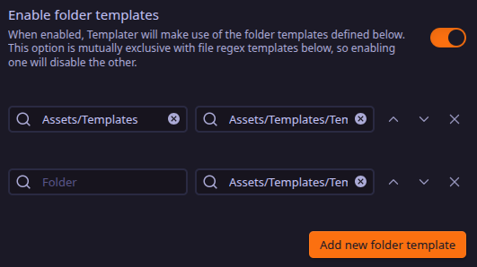

# obsidian-event-manager

## Overview

Automation system that enhances your daily notes in Obsidian by automatically creating and managing events whenever a new daily note is generated.

## Features

- **Automatic deletion** of previous daily notes when a new one is created
- Events stored in a **dashboard** and sorted by time
- **Add** event button:
    - Select a hour dynamically
    - Add a description
    - Add tags
    - Set and update status
- **Remove** event 

## Prerequisites

The following Obsidian plugins are required:

- [`Buttons`](https://obsidian.md/plugins?id=buttons)
- [`Dataview`](https://obsidian.md/plugins?id=dataview)
- [`Templater`](https://obsidian.md/plugins?id=templater-obsidian)

## Configuration

Déposer le répertoire `Assets` sur Obsidian

Plugin `Daily notes`:
- "Template file location" option > `Assets/Templates/Template DN.md` 

Plugin `Templater`:
- "Template folder location" option > `Assets/Templates`
- "Folder templates" section > Follow the example configuration below adding the 2 templates: `Assets/Templates/Template DN.md` and `Assets/Templates/Template New Event.md`

- "User script functions" section:
    - "Script files folder location" option > `Assets/Scripts`

## Usage

To start using `obsidian-event-manager`, click on "Add an event" button
